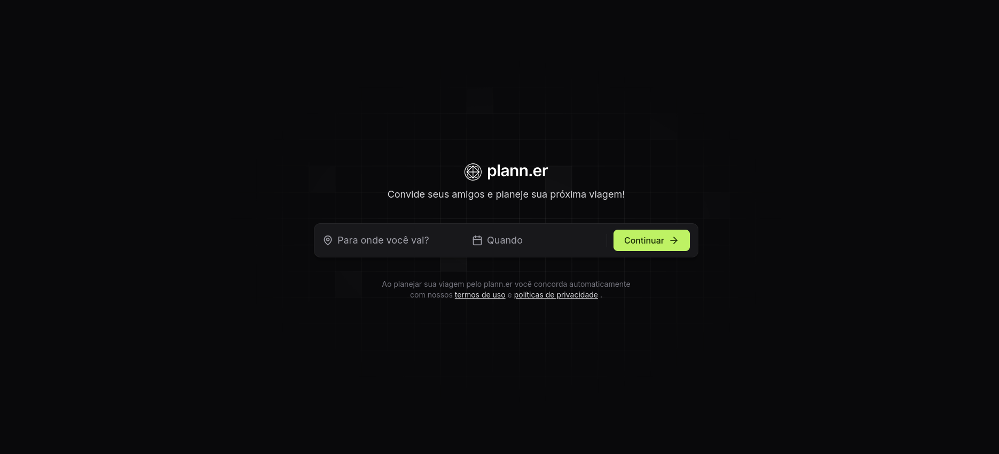
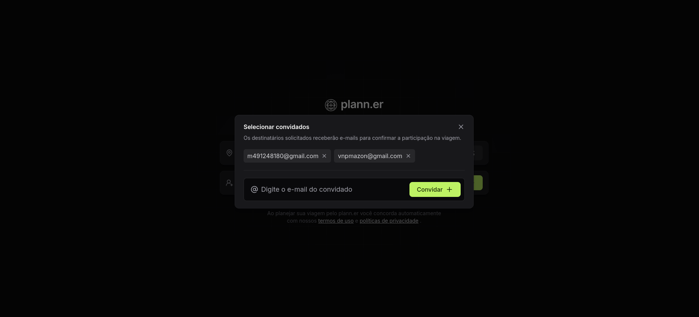
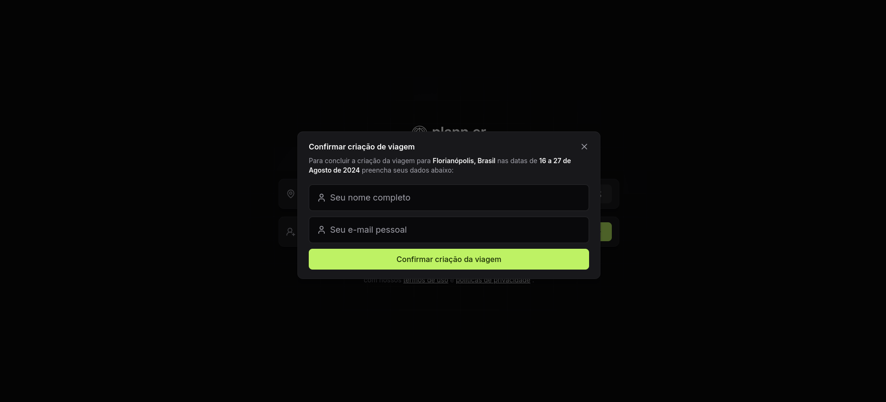

# Planner

## Projeto criado utilizando ReactJs e estilizado com o Tailwind. Consiste em um planner de viagens. Uma API do NodeJs foi usada para complementar a página.

  
  
  

# Funcionalidades

* Inserir cidade e dia da viagem

* Adicionar email para fazer convite

* Confirmação da viagem
  
# Tecnologias Utilizadas

* ReactJS - Para construção da interface

* JavaScript/TypeScript - Para lógica de programação e tipagem 

* TailllWind - Para estilização da interface

* React Hooks - Para gerenciamento de estado

# Como utilizar

1- Clone o projeto
`git@github.com:helen-andrade/planner.git`

2- Instale as dependências
`npm i`

3- Rode o script de desenvolvimento
`npm run dev`

---

  
Feito com ♡ por Helen Andrade

